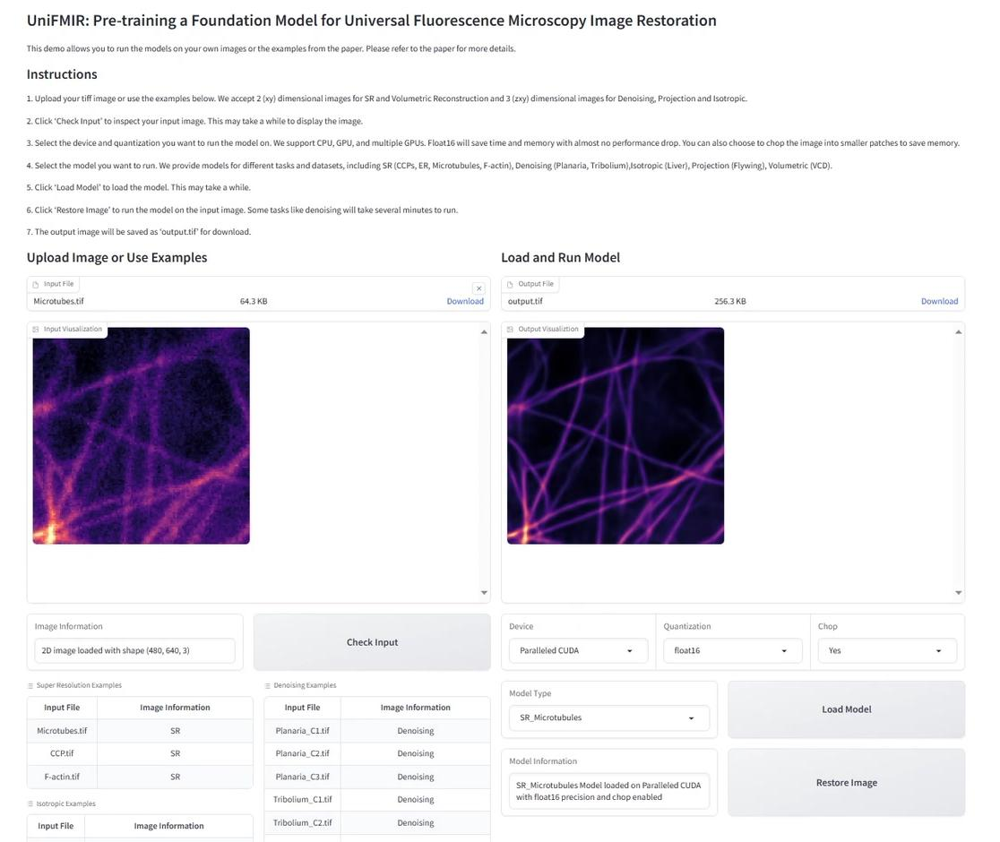

# UniFMIR
Pre-training a Foundation Model for Universal Fluorescence Microscopy Image Restoration

## Online Demo

We provide a live demo for UniFMIR at [http://unifmir.fdudml.cn/](http://unifmir.fdudml.cn/). You can also use the colab <a target="_blank" href="https://colab.research.google.com/github/cxm12/UNiFMIR/blob/main/UniFMIR.ipynb"></a> or employ the following steps to run the demo locally.



## User Interface for UniFMIR

1. Download the Finetuned Models

You can download the finetuned models and the examples of UniFMIR from [the release](https://github.com/cxm12/UNiFMIR/releases). Then, you can 'tar -xzvf' the file and put the folder `small model` in the root directory of UniFMIR.

```
exampledata/
    BioSR/
    Denoise/
    Isotropic/
    Proj/
    volumetric/

experiment/
    SwinIR2t3_stage2VCD/
    SwinIRCCPs/
    SwinIRDenoising_Planaria/
    SwinIRER/
    SwinIRF-actin/
    SwinIRIsotropic_Liver/
    SwinIRMicrotubules/
    SwinIRmto1Denoising_Tribolium/
    SwinIRproj2stg_enlcn_2npzProjection_Flywing/
```

1. Install Packages

* Python 3.9
* Pytorch 1.10.0, CUDA 11.4 and CUDNN 

```
pip install torch==1.10.0+cu111 torchvision==0.11.0+cu111 torchaudio==0.10.0 -f https://download.pytorch.org/whl/torch_stable.html
```

* Python Packages: 

You can install the required python packages by the following command:

```
pip install -r requirements.txt
```

Or you can install the packages manually:
  
```
basicsr          ==          1.4.2
easydict         ==          1.10
imageio          ==          2.13.3
keras            ==          2.7.0
numpy            ==          1.21.5
opencv-python    ==          4.5.4.60
Pillow           ==          9.0.1
scikit-image     ==          0.19.2
scipy            ==          1.7.3
tensorflow-gpu   ==          2.7.0
tifffile         ==          2021.11.2
matplotlib       ==          3.5.0
protobuf         ==          3.20.3
einops           ==          0.6.0
timm             ==          0.6.11
gradio           ==          3.40.1
```

3. Run the Web Interface

You can run the web interface by the following command:

```
python app.py
```

Then, you can visit the web interface at [http://127.0.0.1:7860/](http://127.0.0.1:7860/). You can upload your own image or use our examples to run UniFMIR.

## Test UniFMIR

### 1. Prepare the datasets

All training and test data involved in the experiments are publicly available datasets. You can download our preprocessed data from [the zenodo repository](https://doi.org/10.5281/zenodo.8401470) and unzip them into the corresponding folders. Or you can prepare the dataset according to [the pretraining guidance](https://github.com/cxm12/UNiFMIR/tree/pretrain#readme). Then, edit the `CSB_path` and `VCD_path` in the `./small model/div2k.py` file. The data path should be as follows:

* The 3D denoising/isotropic reconstruction/projection datasets:

```
train: CSB_path/DataSet/
[Denoising_Planaria][Denoising_Tribolium][Isotropic/Isotropic_Liver][Projection_Flywing]/train_data

test: CSB_path/DataSet/
[Denoising_Planaria][Denoising_Tribolium][Isotropic/Isotropic_Liver][Projection_Flywing]/test_data
```

* The SR datasets:

```
train: CSB_path/DataSet/BioSR_WF_to_SIM/DL-SR-main/dataset/train/[CCPs][ER][F-actin][Microtubes]

test: CSB_path/DataSet/BioSR_WF_to_SIM/DL-SR-main/dataset/test/[CCPs][ER][F-actin][Microtubes]
```

* The Volumetric reconstruction dataset:

```
train: VCD_path/vcdnet/vcd-example-data/data/train

test: VCD_path/vcdnet/vcd-example-data/data/to_predict
```

### 2. Test finetuned models

You can run the following command to test UniFMIR on given dataset or you can refer to the `.py` files for your adaptation. Please prepare the models according to [finetuned models](#user-interface-for-unifmir).

```
python mainSR.py # maindenoise.py # mainProjection.py # mainIsotropic.py # main2Dto3D.py
```

Or you can specify the precision ( `single` or `half` ) and the device (`n_GPUs`) by the following command:

```
CUDA_VISIBLE_DEVICES=0,1 python maindenoise.py --precision half --n_GPUs 2
```

## Train UniFMIR

Please refer to the [pretrain branch](https://github.com/cxm12/UNiFMIR/tree/pretrain#readme) for training UniFMIR from scratch.
